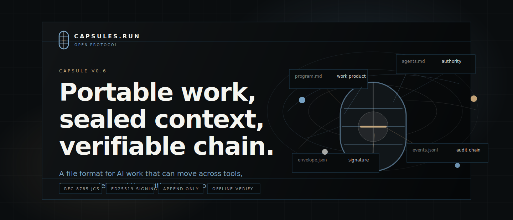
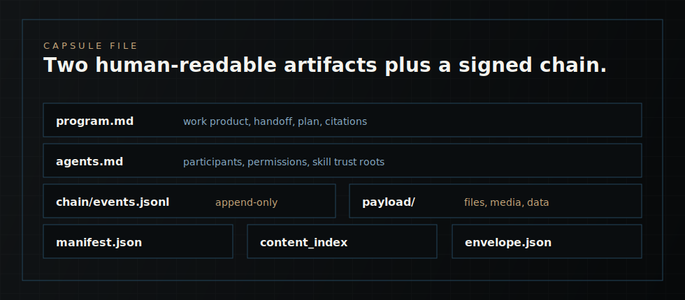

<p align="center">
  
</p>

<p align="center">
  <a href="./spec/">Protocol Spec</a>
  &nbsp;|&nbsp;
  <a href="https://capsules.run/load/">Live Reader</a>
  &nbsp;|&nbsp;
  <a href="https://capsules.run/conformance/">Conformance</a>
  &nbsp;|&nbsp;
  <a href="https://capsules.run/brand-system/">Brand System</a>
  &nbsp;|&nbsp;
  <a href="./ROADMAP.md">Roadmap</a>
</p>

<p align="center">
  
  
  
  
</p>

# Capsules Protocol

> An open protocol for portable, signed, AI-readable records of multi-actor work.

**The canonical protocol source for [Capsules.Run](https://capsules.run).** Built by [Virion.AI](https://virion.ai). MIT licensed. v0.6 prototype.

[Live in-browser reader](https://capsules.run/load/) · [Roadmap](https://capsules.run/roadmap/) · [Conformance](https://capsules.run/conformance/)

---

## One minute to a verified capsule

To verify the protocol implementation locally:

1. **Clone and run.**
   ```sh
   git clone https://github.com/virionai/capsules-protocol
   cd capsules-protocol
   ```

2. **Run the fast verification path:**
   - **JavaScript** (reference impl): `cd sdk-js && npm install && npm test`
   - **Python**: `cd sdk-py && pip install -e . && pytest`
   - **Rust verifier**: `cd verifier-rust && cargo test`

   The JavaScript lane is the quickest local smoke test. The Python and Rust lanes verify cross-implementation parity against the same protocol shape.

3. **Open a real capsule in your browser.**
   Visit [capsules.run/load](https://capsules.run/load/) and use a gallery capsule or drop your own `.capsule` file. The page parses and verifies the chain offline in your browser.

4. **Try the tamper-detection demo.**
   The "Tampered payload" card in the gallery is a capsule with one byte flipped. The reader names the failing check (content_index mismatch). Tamper-evident by construction.

## What's in this repo

```
spec/                  v0.6 protocol specification (normative)
  README.md            stripped/replaced/kept summary
  format.md            file layout
  manifest.md          manifest.json schema
  chain.md             event chain rules
  envelope.md          provenance envelope schema
  trust.md             trust model and skill trust tiers
  pith.md              context-style discipline (informative)

sdk-js/                JavaScript reference SDK (npm)
sdk-py/                Python SDK
sdk-swift/             Swift SDK (iOS/macOS via SwiftPM)
sdk-kotlin/            Kotlin SDK (Android/JVM via Gradle)
verifier-rust/         independent Rust verifier (cargo)
cli/                   command-line verifier and inspector
examples/              generic examples only; illustrative, no warranty
tools/                 conformance harness
.github/workflows/     CI: conformance harness on every push + nightly
```

The `examples/` directory is intentionally generic. Examples demonstrate
portable work products such as reports, tables, graphs, and rendered HTML;
they are illustrative only and carry no warranty.

## The capsule shape

<p align="center">
  
</p>

## What v0.6 is

Capsule v0.6 defines the portable work artifact:

> A portable unit of intelligence. The work product (loan application, AML
> review, scoping document, code, media) travels with the context needed to
> continue it (Pith-style narrative, agents, skills) and an append-only,
> signed audit trail. Foreign LLMs can cold-load it. Regulators and auditors
> can verify it months later. Platforms can ship it as the unit of work.

This directory is a stripped, working prototype of that idea. It is not
backwards-compatible with the prior `0.5.x` shape.

## The protocol earns its weight by being load-bearing in a specific use case

The same protocol applies across regulated work packets, investigations,
project records, and multi-party correspondence. Different domains share
the same capsule format; this repository keeps the portable file shape,
verification semantics, SDKs, CLI, and conformance work separate from
application-specific examples.

## The minimum viable capsule

```
example.capsule (deterministic ZIP)
├── manifest.json                   ~20 fields: id, originator, participants, content_index
├── program.md                      the document: loan app, review, scope, etc.
├── agents.md                       who's allowed to do what; skill-trust roots
├── chain/events.jsonl              append-only signed decision log
├── skills/                         carry-on context for foreign LLMs
│   └── <id>/
│       ├── skill.json              typed metadata
│       └── SKILL.md                instructions (trust tier per agents.md)
├── payload/                        whatever travels: PDFs, code, datasets, media
└── provenance/envelope.json        signed envelope, optional encryption
```

There is no `state.json`, `handoff.md`, `plan.md`, `surface-citations.md`,
or `skills_used_in_this_capsule.md`. State is computed. Handoff is a
section of `program.md`. Plan is a section of `program.md`. Citations are
markdown links. Skill inventory is computed at read.

## Status

Prototype. Not v1.0. The envelope schema is `0.6` on purpose; locked once a second independent implementation round-trips the test vectors and an outside party reviews the crypto. See [ROADMAP.md](ROADMAP.md) for the five review checkpoints.

## Conformance

The conformance harness runs on every push to main plus nightly. Five SDK lanes target the same signed test vectors. The published signal is available at [capsules.run/conformance](https://capsules.run/conformance/).

## Try the demo locally

```sh
cd sdk-js
npm install
npm test
```

The JS test suite builds capsules (clean and tampered) and runs verification on each. The clean capsule passes. Each tampered capsule fails at a distinct, reported check.

For the cross-language conformance harness, see `tools/` and `.github/workflows/conformance.yml`.

## License

MIT. See [LICENSE](LICENSE). Contributing welcome; see [CONTRIBUTING.md](CONTRIBUTING.md). Security disclosure: see [SECURITY.md](SECURITY.md).

---

## Design rationale and history

### The shift: documents to work artifacts

The durable unit is not a document, a chat transcript, or an app-specific
record. It is a portable work artifact that carries enough context to be
opened, verified, continued, and handed off by another actor.

The protocol starts with three pieces:

| Layer | In v0.6 | Purpose |
| --- | --- | --- |
| Content | `program.md`, `payload/`, embedded skills | The readable work product plus the materials needed to continue it |
| State | computed from the manifest, participants, payloads, and event chain | The current operating context without a separate mutable `state.json` |
| Ledger | `chain/events.jsonl`, `provenance/envelope.json` | Append-only history and cryptographic proof of how the work evolved |

That shape gives capsules five properties:

| Property | What it means in the protocol |
| --- | --- |
| Multi-party | Humans, agents, tools, and organizations contribute with attribution |
| Temporal depth | History matters as much as the latest output |
| Continuation | Work can resume across tools, teams, models, and time |
| Verification | Recipients can check who signed what, which files were committed, and whether content was changed |
| Executable context | Skills and agent instructions travel with the artifact, but hosts decide what to run |

In v0.6, `program.md` is the current human-readable surface, state is
computed from protocol data, and the signed chain is the source of temporal
truth.

### Runtime model

Capsules are meant to run anywhere a modern LLM or host can read files and
use tools:

| Mode | How it works |
| --- | --- |
| Skill | Install the Capsule skill so an LLM can read, append, verify, and hand off capsules |
| MCP | Use a Capsule MCP server or compatible tool layer for protocol-native operations |
| Raw | Drop a `.capsule` into a capable model with a bootstrap prompt and inspect it without bespoke infrastructure |

External services can improve distribution, but they are not required for
the core verification story. The file remains the unit.

### v0.6 snapshot

Capsule v0.6 is a small, inspectable file format for moving useful work
between people, agents, tools, and organizations. The artifact carries the
work product, the context required to continue it, the evidence or payload
files it depends on, and the signed record of what happened.

A reader verifies the envelope, checks the manifest content index, walks
`chain/events.jsonl`, reads `program.md` for the current human and AI work
surface, reads `agents.md` for actor and authority context, then renders the
current view. State is computed from verified material at read time. If a
host caches a view for speed, that cache is local convenience, not protocol
truth.

| Layer | What exists | Why it exists |
| --- | --- | --- |
| Container | A deterministic `.capsule` ZIP archive with safe, relative paths | Lets browsers, command-line tools, and offline machines inspect the same artifact without a custom storage service |
| Manifest | `manifest.json` with identity, participants, structure, and content-index hashes | Gives the reader a typed inventory before it renders or reasons over package content |
| Program | `program.md` as the readable work surface and continuation brief | Gives humans and AI systems a shared starting point while keeping authority in the verified chain and host policy |
| Actors | `agents.md` describing participants, allowed roles, and skill trust context | Helps a receiving runtime separate author intent, agent capability, and local execution authority |
| Event chain | `chain/events.jsonl` with append-only events and hash linkage over canonical bytes | Records observations, model turns, decisions, evidence references, and continuation updates in order |
| Payload | Optional `payload/` files and embedded skill bundles | Moves evidence, documents, media, code, or task-specific instructions with the work instead of leaving context behind |
| Envelope | `provenance/envelope.json` with Ed25519 signatures, content hashes, and optional encryption metadata | Lets a recipient verify what arrived before hydrating it into a local agent, workflow, or review tool |

The cold-read order is fixed:

1. Verify the seal: manifest, envelope, content index, signatures, and chain anchors.
2. Read `program.md` as the current work surface.
3. Walk `chain/events.jsonl` to rebuild temporal state.
4. Inspect indexed files as inert evidence. Do not execute payloads by default.
5. Continue by appending a semantic event, then checkpoint and seal.

For normative details, read the five spec documents in [`spec/`](spec/):
[`format.md`](spec/format.md), [`manifest.md`](spec/manifest.md),
[`chain.md`](spec/chain.md), [`envelope.md`](spec/envelope.md), and
[`trust.md`](spec/trust.md).
